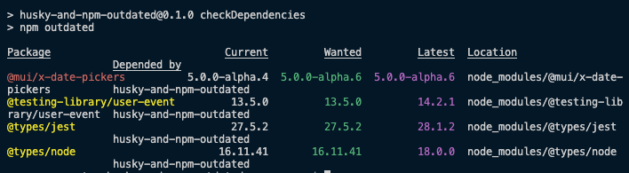

# husky-and-npm-outdated

- This project is a basic create-react-app.
- It was created with node v16.15.1 and npm v8.11.0.

___
## What does it do?

Not a lot.  But it demonstrates a little hack I find useful.

Using a husky post-commit hook, `npm-outdated` is run on every commit.  
- As a _post_ commit hook, it does not prevent the commit, it is strictly for information purposes.
- It simply prints the results of [npm outdated](https://docs.npmjs.com/cli/v8/commands/npm-outdated) to your console, alerting you of any dependencies which you should update, or research.

Mui and its peer dependencies have been installed.  At the time of this repo's creation, the latest version of `@mui/x-date-pickers` was 5.0.0-alpha.6.  But 5.0.0-alpha.4 was intentionally installed to illustrate the script.

___
## How to set it up in any project

1. Follow the [installation instructions](https://typicode.github.io/husky/#/?id=usage) for Husky.  'Automatic' is super easy.
1. Add a script to your package.json file (name it whatever you like):

   ```json
   "checkDependencies": "npm outdated"
   ```
1. Add a post commit hook ([docs](https://typicode.github.io/husky/#/?id=create-a-hook)) to run the script:

   ```bash
   npx husky add .husky/post-commit "npm run checkDependencies"
   ```
1. When you make a commit, you should see the expected output of your script. For example:

   

That's it.  Low tech, yes.  Low effort, oh yes.  If you don't already have a tool in place, this can be a great reminder to you or your team to keep things as current as possible. 

## Running Locally

There's not much to see here, but if you want:

```
npm i && npm start
```